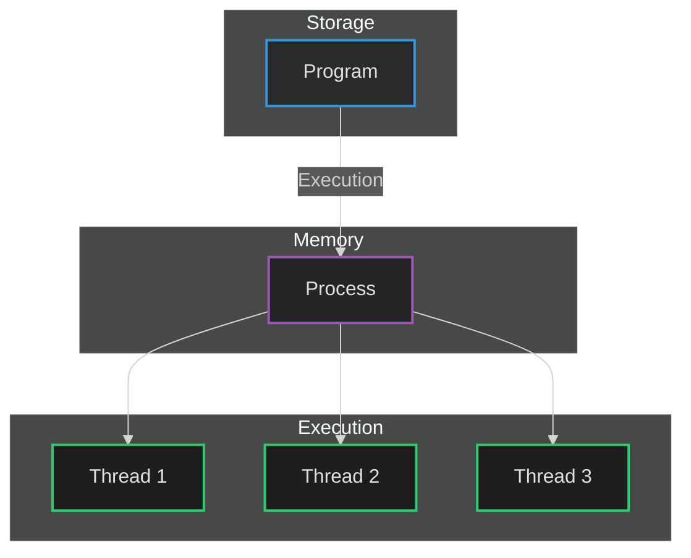
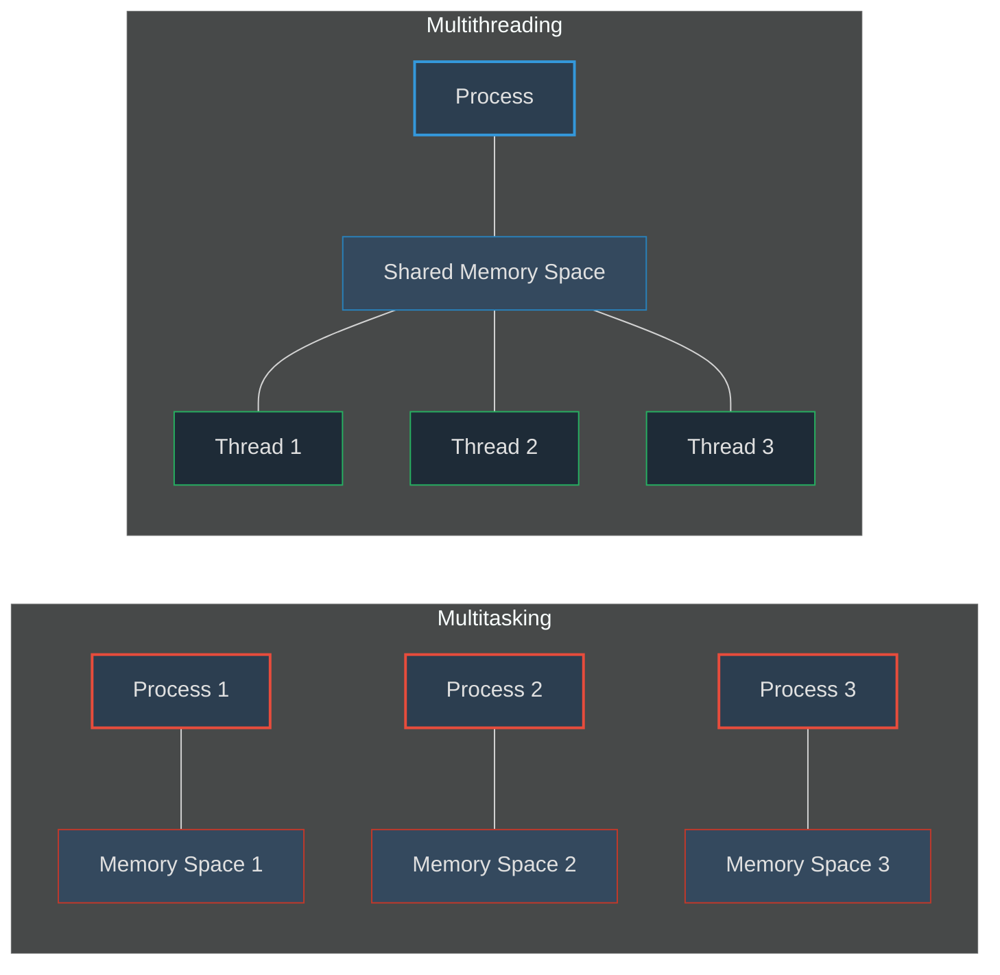

 # Part 3: Multitasking vs Multithreading in Operating Systems

## Key Concepts

<div style="background-color: #2a2a2a; border-left: 4px solid #3498db; padding: 15px; margin: 20px 0; border-radius: 3px; color: #e0e0e0;">
<h3 style="color: #3498db;">Program</h3>
<p>A program is an executable file which contains a certain set of instructions written to complete a specific job or operation on your computer.</p>
<ul>
<li>It's a compiled code, ready to be executed</li>
<li>Stored on disk as a passive entity</li>
<li>Contains code, data, and resources</li>
</ul>
</div>

<div style="background-color: #222222; border-left: 4px solid #9b59b6; padding: 15px; margin: 20px 0; border-radius: 3px; color: #e0e0e0;">
<h3 style="color: #9b59b6;">Process</h3>
<p>A process is a program in execution. It resides in the computer's primary memory (RAM).</p>
<ul>
<li>Active entity with a program counter and associated resources</li>
<li>Has its own address space, memory, data stack, and other auxiliary data</li>
<li>Managed by the operating system's process scheduler</li>
</ul>
</div>

<div style="background-color: #2a2a2a; border-left: 4px solid #2ecc71; padding: 15px; margin: 20px 0; border-radius: 3px; color: #e0e0e0;">
<h3 style="color: #2ecc71;">Thread</h3>
<p>A thread is the smallest unit of execution within a process.</p>
<ul>
<li>Single sequence stream within a process</li>
<li>An independent path of execution in a process</li>
<li>Light-weight process with less overhead</li>
<li>Used to achieve parallelism by dividing a process's tasks into independent paths of execution</li>
</ul>
<p><em>Example:</em> Multiple tabs in a browser or features in a text editor (spell-checking, formatting, and saving the text) are handled concurrently by multiple threads.</p>
</div>

## Visualization of Programs, Processes, and Threads



## Multitasking vs. Multithreading

<table style="width: 100%; border-collapse: collapse; margin: 20px 0; background-color: #1e1e1e; color: #e0e0e0;">
  <tr style="background-color: #333333;">
    <th style="padding: 12px; text-align: left; border: 1px solid #444444; color: #3498db;">Feature</th>
    <th style="padding: 12px; text-align: left; border: 1px solid #444444; color: #3498db;">Multitasking</th>
    <th style="padding: 12px; text-align: left; border: 1px solid #444444; color: #3498db;">Multithreading</th>
  </tr>
  <tr style="background-color: #2a2a2a;">
    <td style="padding: 12px; border: 1px solid #444444;"><strong style="color: #f39c12;">Definition</strong></td>
    <td style="padding: 12px; border: 1px solid #444444;">The execution of more than one task (process) simultaneously</td>
    <td style="padding: 12px; border: 1px solid #444444;">A process is divided into several different sub-tasks (threads), each with its own path of execution</td>
  </tr>
  <tr style="background-color: #252525;">
    <td style="padding: 12px; border: 1px solid #444444;"><strong style="color: #f39c12;">Execution Unit</strong></td>
    <td style="padding: 12px; border: 1px solid #444444;">Processes are context switched</td>
    <td style="padding: 12px; border: 1px solid #444444;">Threads are context switched</td>
  </tr>
  <tr style="background-color: #2a2a2a;">
    <td style="padding: 12px; border: 1px solid #444444;"><strong style="color: #f39c12;">CPU Requirement</strong></td>
    <td style="padding: 12px; border: 1px solid #444444;">Can work efficiently with a single CPU</td>
    <td style="padding: 12px; border: 1px solid #444444;">Better performance with multiple CPUs/cores</td>
  </tr>
  <tr style="background-color: #252525;">
    <td style="padding: 12px; border: 1px solid #444444;"><strong style="color: #f39c12;">Memory & Resources</strong></td>
    <td style="padding: 12px; border: 1px solid #444444;">Isolation and memory protection exists. OS allocates separate memory and resources to each program</td>
    <td style="padding: 12px; border: 1px solid #444444;">No isolation or memory protection between threads. Resources are shared among threads of the same process</td>
  </tr>
  <tr style="background-color: #2a2a2a;">
    <td style="padding: 12px; border: 1px solid #444444;"><strong style="color: #f39c12;">Communication</strong></td>
    <td style="padding: 12px; border: 1px solid #444444;">Inter-Process Communication (IPC) mechanisms needed for processes to communicate</td>
    <td style="padding: 12px; border: 1px solid #444444;">Direct communication through shared memory within the process</td>
  </tr>
  <tr style="background-color: #252525;">
    <td style="padding: 12px; border: 1px solid #444444;"><strong style="color: #f39c12;">Creation Overhead</strong></td>
    <td style="padding: 12px; border: 1px solid #444444;">High overhead for process creation</td>
    <td style="padding: 12px; border: 1px solid #444444;">Low overhead for thread creation</td>
  </tr>
</table>

## Visual Representation of Multitasking vs. Multithreading



## Thread Scheduling

<div style="background-color: #222222; border-left: 4px solid #9b59b6; padding: 15px; margin: 20px 0; border-radius: 3px; color: #e0e0e0;">
<p>Threads are scheduled for execution based on their priority. Even though threads are executing within the runtime, all threads are assigned processor time slices by the operating system. The scheduler may use various algorithms like:</p>

<ul>
<li>Priority-based scheduling</li>
<li>Round-robin scheduling</li>
<li>Multilevel queue scheduling</li>
</ul>

<p>The scheduler ensures fair distribution of CPU time among threads while respecting priority constraints.</p>
</div>

## Context Switching: Thread vs Process

<table style="width: 100%; border-collapse: collapse; margin: 20px 0; background-color: #1e1e1e; color: #e0e0e0;">
  <tr style="background-color: #333333;">
    <th style="padding: 12px; text-align: left; border: 1px solid #444444; color: #3498db;">Aspect</th>
    <th style="padding: 12px; text-align: left; border: 1px solid #444444; color: #3498db;">Thread Context Switching</th>
    <th style="padding: 12px; text-align: left; border: 1px solid #444444; color: #3498db;">Process Context Switching</th>
  </tr>
  <tr style="background-color: #2a2a2a;">
    <td style="padding: 12px; border: 1px solid #444444;"><strong style="color: #f39c12;">Definition</strong></td>
    <td style="padding: 12px; border: 1px solid #444444;">OS saves current state of thread & switches to another thread of same process</td>
    <td style="padding: 12px; border: 1px solid #444444;">OS saves current state of process & switches to another process by restoring its state</td>
  </tr>
  <tr style="background-color: #252525;">
    <td style="padding: 12px; border: 1px solid #444444;"><strong style="color: #f39c12;">Memory Address Space</strong></td>
    <td style="padding: 12px; border: 1px solid #444444;">Doesn't include switching of memory address space (But program counter, registers & stack are included)</td>
    <td style="padding: 12px; border: 1px solid #444444;">Includes switching of memory address space</td>
  </tr>
  <tr style="background-color: #2a2a2a;">
    <td style="padding: 12px; border: 1px solid #444444;"><strong style="color: #f39c12;">Speed</strong></td>
    <td style="padding: 12px; border: 1px solid #444444;">Fast switching</td>
    <td style="padding: 12px; border: 1px solid #444444;">Slow switching</td>
  </tr>
  <tr style="background-color: #252525;">
    <td style="padding: 12px; border: 1px solid #444444;"><strong style="color: #f39c12;">CPU Cache</strong></td>
    <td style="padding: 12px; border: 1px solid #444444;">CPU's cache state is preserved</td>
    <td style="padding: 12px; border: 1px solid #444444;">CPU's cache state is flushed</td>
  </tr>
  <tr style="background-color: #2a2a2a;">
    <td style="padding: 12px; border: 1px solid #444444;"><strong style="color: #f39c12;">Overhead</strong></td>
    <td style="padding: 12px; border: 1px solid #444444;">Lower overhead</td>
    <td style="padding: 12px; border: 1px solid #444444;">Higher overhead</td>
  </tr>
</table>

## Visual Representation of Context Switching

```mermaid
%%{init: {'theme': 'dark'}}%%
sequenceDiagram
    participant CPU
    participant Process1 as Process 1
    participant Process2 as Process 2
    participant Thread1 as Thread 1 (Proc 1)
    participant Thread2 as Thread 2 (Proc 1)
    
    Note over CPU,Process2: Process Context Switch (Heavy)
    CPU->>Process1: Execute
    Process1->>CPU: Save State (Complete)
    CPU->>Process2: Load State (Complete)
    CPU->>Process2: Execute
    
    Note over CPU,Thread2: Thread Context Switch (Light)
    CPU->>Thread1: Execute
    Thread1->>CPU: Save State (Minimal)
    CPU->>Thread2: Load State (Minimal)
    CPU->>Thread2: Execute
    
    style CPU fill:#1e1e1e,stroke:#3498db,stroke-width:2px
    style Process1 fill:#2c3e50,stroke:#e74c3c,stroke-width:2px
    style Process2 fill:#2c3e50,stroke:#e74c3c,stroke-width:2px
    style Thread1 fill:#2c3e50,stroke:#2ecc71,stroke-width:2px
    style Thread2 fill:#2c3e50,stroke:#2ecc71,stroke-width:2px
```

## Benefits and Challenges

### Benefits of Multithreading

<div style="background-color: #1a2639; border-left: 4px solid #3498db; padding: 15px; margin: 20px 0; border-radius: 3px; color: #e0e0e0;">
<ul>
<li><strong style="color: #3498db;">Improved Responsiveness:</strong> Applications remain responsive while performing background tasks</li>
<li><strong style="color: #3498db;">Resource Sharing:</strong> Threads share resources of the process, reducing overhead</li>
<li><strong style="color: #3498db;">Economy:</strong> Creating and context-switching threads is more economical than processes</li>
<li><strong style="color: #3498db;">Scalability:</strong> Better utilization of multiprocessor architectures</li>
<li><strong style="color: #3498db;">Communication:</strong> Communication between threads is simpler than between processes</li>
</ul>
</div>

### Challenges in Multithreaded Programming

<div style="background-color: #2a1b1b; border-left: 4px solid #e74c3c; padding: 15px; margin: 20px 0; border-radius: 3px; color: #e0e0e0;">
<ul>
<li><strong style="color: #e74c3c;">Synchronization Issues:</strong> Race conditions, deadlocks, and starvation</li>
<li><strong style="color: #e74c3c;">Debugging Complexity:</strong> Harder to debug than single-threaded applications</li>
<li><strong style="color: #e74c3c;">Thread Safety:</strong> Ensuring data integrity when multiple threads access shared resources</li>
<li><strong style="color: #e74c3c;">Overhead:</strong> Thread management introduces some overhead</li>
<li><strong style="color: #e74c3c;">Non-determinism:</strong> Program execution can vary between runs due to scheduling</li>
</ul>
</div>