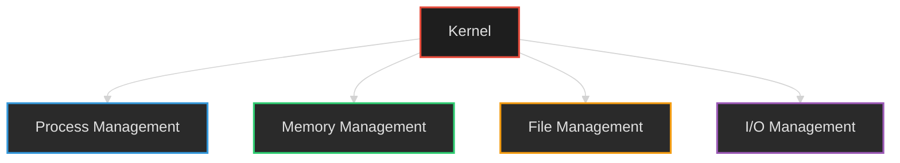
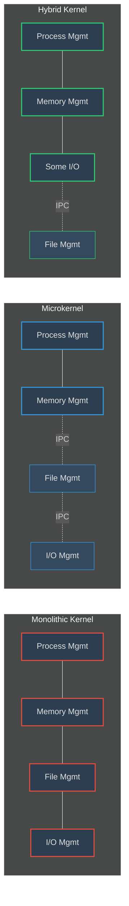

# Part 4: Components of an Operating System

## Core System Components

An operating system consists of several key components that work together to manage resources and provide services to users and applications.

<div style="background-color: #2a2a2a; border-left: 4px solid #e74c3c; padding: 15px; margin: 20px 0; border-radius: 3px; color: #e0e0e0;">
<h3 style="color: #e74c3c;">1. Kernel</h3>
<p>The kernel is the central component of an operating system that interacts directly with the hardware and performs the most crucial tasks.</p>
<ul>
<li>Heart of the operating system and core component</li>
<li>Very first part of the OS to load on start-up</li>
<li>Manages hardware resources including CPU, memory, and I/O devices</li>
<li>Runs in privileged mode with full access to all hardware</li>
</ul>
</div>

<div style="background-color: #222222; border-left: 4px solid #3498db; padding: 15px; margin: 20px 0; border-radius: 3px; color: #e0e0e0;">
<h3 style="color: #3498db;">2. User Space</h3>
<p>User space is the memory area where application software runs. Applications in user space don't have privileged access to the underlying hardware and must interact with the kernel for hardware access.</p>
<ul>
<li><strong style="color: #3498db;">GUI (Graphical User Interface):</strong> Provides visual interaction through windows, icons, and graphical elements</li>
<li><strong style="color: #3498db;">CLI (Command Line Interface):</strong> Text-based interface for interacting with the system through commands</li>
</ul>
</div>

<div style="background-color: #2a2a2a; border-left: 4px solid #2ecc71; padding: 15px; margin: 20px 0; border-radius: 3px; color: #e0e0e0;">
<h3 style="color: #2ecc71;">3. Shell</h3>
<p>A shell, also known as a command interpreter, is the part of the operating system that receives commands from users and executes them. It serves as an interface between the user and the kernel.</p>
<ul>
<li>Interprets user commands</li>
<li>Provides access to OS services</li>
<li>Examples include Bash, PowerShell, Zsh, and Command Prompt</li>
</ul>
</div> an operating system

1. Kernel: A kernel is that part of the operating system which interacts directly with
the hardware andperforms the most crucialtasks.
a. Heart of OS/Core component
b. Very first part of OS to load on start-up.
2. User space: Where application software runs, apps don’t have privileged access to the
underlying hardware. It interacts with kernel.
a. GUI
b. CLI

A shell, also known as a command interpreter, is that part of the operating system that receives
commands from the users and gets them executed.
## Kernel Functions

The kernel performs several essential functions that form the foundation of the operating system's capabilities:



<div style="background-color: #1a2639; border-left: 4px solid #3498db; padding: 15px; margin: 20px 0; border-radius: 3px; color: #e0e0e0;">
<h3 style="color: #3498db;">1. Process Management</h3>
<p>Process management involves controlling the creation, deletion, and synchronization of processes.</p>
<ul>
<li>Scheduling processes and threads on the CPUs</li>
<li>Creating and deleting both user and system processes</li>
<li>Suspending and resuming processes</li>
<li>Providing mechanisms for process synchronization and communication</li>
<li>Managing process state transitions (new, ready, running, waiting, terminated)</li>
</ul>
</div>

<div style="background-color: #162623; border-left: 4px solid #2ecc71; padding: 15px; margin: 20px 0; border-radius: 3px; color: #e0e0e0;">
<h3 style="color: #2ecc71;">2. Memory Management</h3>
<p>Memory management ensures efficient use of system memory and provides isolation between processes.</p>
<ul>
<li>Allocating and deallocating memory space as needed</li>
<li>Keeping track of which memory parts are currently being used and by which processes</li>
<li>Implementing virtual memory systems using paging and/or segmentation</li>
<li>Managing memory protection to ensure process isolation</li>
<li>Optimizing memory usage through techniques like swapping and garbage collection</li>
</ul>
</div>

<div style="background-color: #2a2617; border-left: 4px solid #f39c12; padding: 15px; margin: 20px 0; border-radius: 3px; color: #e0e0e0;">
<h3 style="color: #f39c12;">3. File Management</h3>
<p>File management involves controlling file operations and the organization of data on storage devices.</p>
<ul>
<li>Creating and deleting files</li>
<li>Creating and deleting directories to organize files</li>
<li>Mapping files into secondary storage</li>
<li>Providing backup support onto stable storage media</li>
<li>Managing file permissions and access controls</li>
<li>Implementing file systems (FAT, NTFS, ext4, etc.)</li>
</ul>
</div>

<div style="background-color: #22192d; border-left: 4px solid #9b59b6; padding: 15px; margin: 20px 0; border-radius: 3px; color: #e0e0e0;">
<h3 style="color: #9b59b6;">4. I/O Management</h3>
<p>I/O management controls input/output operations and manages I/O devices connected to the system.</p>
<ul>
<li>Managing device drivers for hardware communication</li>
<li>Implementing buffering, caching, and spooling techniques:
    <ul>
        <li><strong style="color: #9b59b6;">Spooling:</strong> Handles operations between devices with different speeds (e.g., print spooling, mail spooling)</li>
        <li><strong style="color: #9b59b6;">Buffering:</strong> Temporary data storage within a job (e.g., video buffering during streaming)</li>
        <li><strong style="color: #9b59b6;">Caching:</strong> Stores frequently accessed data for faster retrieval (e.g., memory caching, web caching)</li>
    </ul>
</li>
<li>Handling interrupt signals from hardware devices</li>
<li>Providing a uniform interface for diverse device types</li>
</ul>
</div>

## Types of Kernel Architecture

Operating system kernels can be categorized into several architectural types, each with its own advantages and disadvantages.



<table style="width: 100%; border-collapse: collapse; margin: 20px 0; background-color: #1e1e1e; color: #e0e0e0;">
  <tr style="background-color: #333333;">
    <th style="padding: 12px; text-align: left; border: 1px solid #444444; color: #3498db;">Feature</th>
    <th style="padding: 12px; text-align: left; border: 1px solid #444444; color: #e74c3c;">Monolithic Kernel</th>
    <th style="padding: 12px; text-align: left; border: 1px solid #444444; color: #3498db;">Microkernel</th>
    <th style="padding: 12px; text-align: left; border: 1px solid #444444; color: #2ecc71;">Hybrid Kernel</th>
  </tr>
  <tr style="background-color: #2a2a2a;">
    <td style="padding: 12px; border: 1px solid #444444;"><strong style="color: #f39c12;">Architecture</strong></td>
    <td style="padding: 12px; border: 1px solid #444444;">All functions are in kernel space</td>
    <td style="padding: 12px; border: 1px solid #444444;">Only essential functions (memory mgmt, process mgmt) in kernel space; others in user space</td>
    <td style="padding: 12px; border: 1px solid #444444;">Combined approach with some services in kernel space and others in user space</td>
  </tr>
  <tr style="background-color: #252525;">
    <td style="padding: 12px; border: 1px solid #444444;"><strong style="color: #f39c12;">Size</strong></td>
    <td style="padding: 12px; border: 1px solid #444444;">Bulky in size</td>
    <td style="padding: 12px; border: 1px solid #444444;">Smaller in size</td>
    <td style="padding: 12px; border: 1px solid #444444;">Moderate size</td>
  </tr>
  <tr style="background-color: #2a2a2a;">
    <td style="padding: 12px; border: 1px solid #444444;"><strong style="color: #f39c12;">Memory Usage</strong></td>
    <td style="padding: 12px; border: 1px solid #444444;">Higher memory requirements</td>
    <td style="padding: 12px; border: 1px solid #444444;">Lower memory requirements</td>
    <td style="padding: 12px; border: 1px solid #444444;">Moderate memory requirements</td>
  </tr>
  <tr style="background-color: #252525;">
    <td style="padding: 12px; border: 1px solid #444444;"><strong style="color: #f39c12;">Reliability</strong></td>
    <td style="padding: 12px; border: 1px solid #444444;">Less reliable; one module crash can bring down the entire kernel</td>
    <td style="padding: 12px; border: 1px solid #444444;">More reliable; service crashes don't affect the kernel</td>
    <td style="padding: 12px; border: 1px solid #444444;">Moderately reliable</td>
  </tr>
  <tr style="background-color: #2a2a2a;">
    <td style="padding: 12px; border: 1px solid #444444;"><strong style="color: #f39c12;">Performance</strong></td>
    <td style="padding: 12px; border: 1px solid #444444;">High performance due to less context switching</td>
    <td style="padding: 12px; border: 1px solid #444444;">Lower performance due to frequent user-kernel mode switching</td>
    <td style="padding: 12px; border: 1px solid #444444;">Good balance between performance and reliability</td>
  </tr>
  <tr style="background-color: #252525;">
    <td style="padding: 12px; border: 1px solid #444444;"><strong style="color: #f39c12;">Examples</strong></td>
    <td style="padding: 12px; border: 1px solid #444444;">Linux, Unix, MS-DOS</td>
    <td style="padding: 12px; border: 1px solid #444444;">L4 Linux, Symbian OS, MINIX</td>
    <td style="padding: 12px; border: 1px solid #444444;">macOS, Windows NT/7/10/11</td>
  </tr>
</table>

### Other Kernel Types

<div style="background-color: #1e2836; border-left: 4px solid #f1c40f; padding: 15px; margin: 20px 0; border-radius: 3px; color: #e0e0e0;">
<h4 style="color: #f1c40f;">Nanokernel & Exokernel</h4>
<p>These are even more minimal kernel designs that provide only the most basic hardware abstraction.</p>
<ul>
<li><strong style="color: #f1c40f;">Nanokernel:</strong> Provides the bare minimum functionality needed for an operating system, often used in embedded systems</li>
<li><strong style="color: #f1c40f;">Exokernel:</strong> Provides only resource protection and multiplexing, allowing applications direct control of hardware resources</li>
</ul>
</div>

## User Mode and Kernel Mode Communication

<div style="background-color: #2a2a2a; border-left: 4px solid #9b59b6; padding: 15px; margin: 20px 0; border-radius: 3px; color: #e0e0e0;">
<h3 style="color: #9b59b6;">Inter-Process Communication (IPC)</h3>
<p>For operating systems that separate functionality between kernel mode and user mode, communication between these modes is essential.</p>

<p>IPC allows processes that execute independently with separate memory spaces (memory protection) to exchange data and coordinate their activities.</p>
</div>

```mermaid
%%{init: {'theme': 'dark'}}%%
sequenceDiagram
    participant UP as User Process
    participant UM as User Mode
    participant KM as Kernel Mode
    participant KS as Kernel Service
    
    UP->>UM: Request Service
    UM->>KM: System Call
    Note over UM,KM: Mode Switch
    KM->>KS: Execute Service
    KS-->>KM: Return Result
    KM-->>UM: Return to User Mode
    Note over KM,UM: Mode Switch
    UM-->>UP: Service Result
    
    style UP fill:#2c3e50,stroke:#3498db,stroke-width:2px
    style UM fill:#34495e,stroke:#3498db,stroke-width:2px
    style KM fill:#2c3e50,stroke:#e74c3c,stroke-width:2px
    style KS fill:#34495e,stroke:#e74c3c,stroke-width:2px
```

### Common IPC Mechanisms

<div style="background-color: #1e2836; border-left: 4px solid #3498db; padding: 15px; margin: 20px 0; border-radius: 3px; color: #e0e0e0;">
<h4 style="color: #3498db;">1. Shared Memory</h4>
<p>A region of memory that multiple processes can access to exchange information.</p>
<ul>
<li>Fast once set up as no kernel involvement is needed for data transfer</li>
<li>Requires synchronization mechanisms to prevent concurrent access issues</li>
<li>Commonly used for large data transfers between processes</li>
</ul>
</div>

<div style="background-color: #222222; border-left: 4px solid #2ecc71; padding: 15px; margin: 20px 0; border-radius: 3px; color: #e0e0e0;">
<h4 style="color: #2ecc71;">2. Message Passing</h4>
<p>Processes communicate by exchanging messages through the kernel.</p>
<ul>
<li>More structured than shared memory</li>
<li>Can be implemented as pipes, message queues, or sockets</li>
<li>Kernel mediates the communication, adding some overhead</li>
<li>Better for small data transfers and distributed systems</li>
</ul>
</div>

<div style="background-color: #1e2836; border-left: 4px solid #e74c3c; padding: 15px; margin: 20px 0; border-radius: 3px; color: #e0e0e0;">
<h4 style="color: #e74c3c;">3. Signals</h4>
<p>Software interrupts that notify processes of specific events.</p>
<ul>
<li>Used for asynchronous event notification</li>
<li>Limited information transfer capability</li>
<li>Examples include SIGTERM, SIGKILL, SIGINT</li>
</ul>
</div>

<div style="background-color: #222222; border-left: 4px solid #f39c12; padding: 15px; margin: 20px 0; border-radius: 3px; color: #e0e0e0;">
<h4 style="color: #f39c12;">4. System Calls</h4>
<p>The primary mechanism for applications to request services from the kernel.</p>
<ul>
<li>Interface between user mode and kernel mode</li>
<li>Triggers a context switch from user mode to kernel mode</li>
<li>Examples include open(), read(), write(), close() for file operations</li>
</ul>
</div>

## Conclusion

The architecture and components of an operating system determine its performance, reliability, and functionality. From the kernel's core functions to the various interface layers, each component plays a critical role in creating a cohesive and efficient system. Understanding these components and their interactions is essential for optimizing system performance and developing compatible software.

Modern operating systems continue to evolve with hybrid approaches that balance performance and reliability, while microkernel designs find their place in specialized applications where stability is paramount.