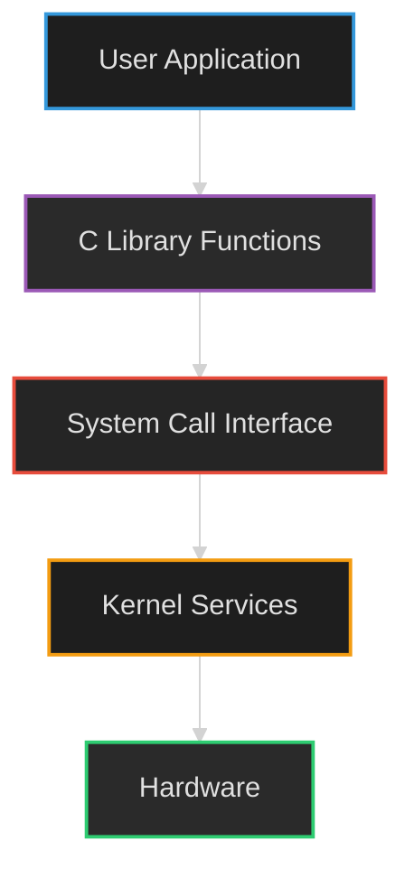
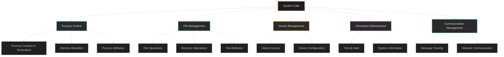

  # Part 5: System Calls

## Introduction to System Calls

<div style="background-color: #2a2a2a; border-left: 4px solid #e74c3c; padding: 15px; margin: 20px 0; border-radius: 3px; color: #e0e0e0;">
<h3 style="color: #e74c3c;">What are System Calls?</h3>
<p>A system call is a programmatic way for an application to request services from the kernel of the operating system. It serves as a gateway between user space and kernel space, providing a controlled interface to the hardware and protected resources.</p>
<ul>
<li>System calls are the <strong style="color: #e74c3c;">only way</strong> through which a process can transition from user mode to kernel mode</li>
<li>They provide a secure mechanism for user programs to access resources they don't have direct permission to use</li>
<li>Most system calls are implemented in C programming language</li>
<li>Transitions between user space and kernel space are facilitated by software interrupts</li>
</ul>
</div>



## How Applications Interact with the Kernel

<div style="background-color: #222222; border-left: 4px solid #3498db; padding: 15px; margin: 20px 0; border-radius: 3px; color: #e0e0e0;">
<h3 style="color: #3498db;">The System Call Process</h3>

<p>Applications interact with the kernel through system calls, typically through abstracted library functions rather than direct system call invocations.</p>

<h4 style="color: #3498db;">Example 1: Creating a Directory</h4>
<pre style="background-color: #1a1a1a; padding: 10px; color: #e0e0e0; border-radius: 3px;">$ mkdir documents</pre>

<ol>
<li>The <code>mkdir</code> command is executed in user space</li>
<li>This command is a wrapper around the actual system call</li>
<li>It indirectly calls the kernel and requests the file management module to create a new directory</li>
<li>The kernel performs the operation with its privileged access</li>
<li>Control returns to user space upon completion</li>
</ol>

<h4 style="color: #3498db;">Example 2: Creating a Process</h4>
<ol>
<li>User initiates process creation (user space)</li>
<li>The operation triggers a system call (still in user space)</li>
<li>The <code>exec</code> system call transitions control to kernel space</li>
<li>The kernel creates the process with its privileged capabilities</li>
<li>Control returns to user space when complete</li>
</ol>
</div>

<div style="background-color: #1a2639; border-left: 4px solid #2ecc71; padding: 15px; margin: 20px 0; border-radius: 3px; color: #e0e0e0;">
<h3 style="color: #2ecc71;">Why System Calls?</h3>
<p>System calls exist primarily for security and stability reasons:</p>
<ul>
<li>User programs typically don't have permission to perform operations like accessing I/O devices directly</li>
<li>They prevent applications from interfering with each other or damaging the system</li>
<li>They provide a stable, consistent interface that doesn't change even when hardware changes</li>
<li>They abstract complex hardware interactions into simpler programming interfaces</li>
</ul>
</div>


## Types of System Calls

System calls can be categorized into several groups based on the functionality they provide:



<div style="display: grid; grid-template-columns: repeat(auto-fit, minmax(300px, 1fr)); gap: 20px; margin: 20px 0;">
    <div style="background-color: #1a2639; border-left: 4px solid #3498db; padding: 15px; border-radius: 3px; color: #e0e0e0;">
        <h3 style="color: #3498db;">1. Process Control</h3>
        <ul>
            <li>End, abort program execution</li>
            <li>Load, execute programs</li>
            <li>Create process, terminate process</li>
            <li>Get process attributes, set process attributes</li>
            <li>Wait for time</li>
            <li>Wait event, signal event</li>
            <li>Allocate and free memory</li>
        </ul>
    </div>
    
    <div style="background-color: #162623; border-left: 4px solid #2ecc71; padding: 15px; border-radius: 3px; color: #e0e0e0;">
        <h3 style="color: #2ecc71;">2. File Management</h3>
        <ul>
            <li>Create file, delete file</li>
            <li>Open, close files</li>
            <li>Read, write, reposition within files</li>
            <li>Get file attributes, set file attributes</li>
            <li>Create, modify directories</li>
            <li>Link, unlink files</li>
        </ul>
    </div>
</div>

<div style="display: grid; grid-template-columns: repeat(auto-fit, minmax(300px, 1fr)); gap: 20px; margin: 20px 0;">
    <div style="background-color: #2a2617; border-left: 4px solid #f39c12; padding: 15px; border-radius: 3px; color: #e0e0e0;">
        <h3 style="color: #f39c12;">3. Device Management</h3>
        <ul>
            <li>Request device, release device</li>
            <li>Read, write, reposition device</li>
            <li>Get device attributes, set device attributes</li>
            <li>Logically attach or detach devices</li>
            <li>Control device operations</li>
        </ul>
    </div>
    
    <div style="background-color: #22192d; border-left: 4px solid #9b59b6; padding: 15px; border-radius: 3px; color: #e0e0e0;">
        <h3 style="color: #9b59b6;">4. Information Maintenance</h3>
        <ul>
            <li>Get time or date, set time or date</li>
            <li>Get system data, set system data</li>
            <li>Get process, file, or device attributes</li>
            <li>Set process, file, or device attributes</li>
            <li>Query system statistics and configurations</li>
        </ul>
    </div>
</div>

<div style="background-color: #1a2e2d; border-left: 4px solid #1abc9c; padding: 15px; margin: 20px 0; border-radius: 3px; color: #e0e0e0;">
    <h3 style="color: #1abc9c;">5. Communication Management</h3>
    <ul>
        <li>Create, delete communication connection</li>
        <li>Send, receive messages</li>
        <li>Transfer status information</li>
        <li>Attach or detach remote devices</li>
        <li>Create and manage network sockets</li>
        <li>Establish secure communication channels</li>
    </ul>
</div>


## System Call Examples: Windows vs. Unix

Different operating systems implement system calls differently. Below is a comparison of common system calls in Windows and Unix-based systems:

<table style="width: 100%; border-collapse: collapse; margin: 20px 0; background-color: #1e1e1e; color: #e0e0e0;">
  <tr style="background-color: #333333;">
    <th style="padding: 12px; text-align: left; border: 1px solid #444444; color: #3498db;">Category</th>
    <th style="padding: 12px; text-align: left; border: 1px solid #444444; color: #3498db;">Windows</th>
    <th style="padding: 12px; text-align: left; border: 1px solid #444444; color: #3498db;">Unix/Linux</th>
  </tr>
  <tr style="background-color: #2a2a2a;">
    <td style="padding: 12px; border: 1px solid #444444; vertical-align: top;"><strong style="color: #3498db;">Process Control</strong></td>
    <td style="padding: 12px; border: 1px solid #444444; vertical-align: top;">
      <code>CreateProcess()</code><br>
      <code>ExitProcess()</code><br>
      <code>WaitForSingleObject()</code><br>
      <code>TerminateProcess()</code>
    </td>
    <td style="padding: 12px; border: 1px solid #444444; vertical-align: top;">
      <code>fork()</code><br>
      <code>exit()</code><br>
      <code>wait()</code><br>
      <code>exec()</code>
    </td>
  </tr>
  <tr style="background-color: #252525;">
    <td style="padding: 12px; border: 1px solid #444444; vertical-align: top;"><strong style="color: #2ecc71;">File Management</strong></td>
    <td style="padding: 12px; border: 1px solid #444444; vertical-align: top;">
      <code>CreateFile()</code><br>
      <code>ReadFile()</code><br>
      <code>WriteFile()</code><br>
      <code>CloseHandle()</code><br>
      <code>SetFileSecurity()</code><br>
      <code>InitializeSecurityDescriptor()</code><br>
      <code>SetSecurityDescriptorGroup()</code>
    </td>
    <td style="padding: 12px; border: 1px solid #444444; vertical-align: top;">
      <code>open()</code><br>
      <code>read()</code><br>
      <code>write()</code><br>
      <code>close()</code><br>
      <code>chmod()</code><br>
      <code>umask()</code><br>
      <code>chown()</code>
    </td>
  </tr>
  <tr style="background-color: #2a2a2a;">
    <td style="padding: 12px; border: 1px solid #444444; vertical-align: top;"><strong style="color: #f39c12;">Device Management</strong></td>
    <td style="padding: 12px; border: 1px solid #444444; vertical-align: top;">
      <code>SetConsoleMode()</code><br>
      <code>ReadConsole()</code><br>
      <code>WriteConsole()</code><br>
      <code>DeviceIoControl()</code>
    </td>
    <td style="padding: 12px; border: 1px solid #444444; vertical-align: top;">
      <code>ioctl()</code><br>
      <code>read()</code><br>
      <code>write()</code><br>
      <code>mknod()</code>
    </td>
  </tr>
  <tr style="background-color: #252525;">
    <td style="padding: 12px; border: 1px solid #444444; vertical-align: top;"><strong style="color: #9b59b6;">Information Management</strong></td>
    <td style="padding: 12px; border: 1px solid #444444; vertical-align: top;">
      <code>GetCurrentProcessID()</code><br>
      <code>SetTimer()</code><br>
      <code>Sleep()</code><br>
      <code>GetSystemTime()</code>
    </td>
    <td style="padding: 12px; border: 1px solid #444444; vertical-align: top;">
      <code>getpid()</code><br>
      <code>alarm()</code><br>
      <code>sleep()</code><br>
      <code>time()</code>
    </td>
  </tr>
  <tr style="background-color: #2a2a2a;">
    <td style="padding: 12px; border: 1px solid #444444; vertical-align: top;"><strong style="color: #1abc9c;">Communication</strong></td>
    <td style="padding: 12px; border: 1px solid #444444; vertical-align: top;">
      <code>CreatePipe()</code><br>
      <code>CreateFileMapping()</code><br>
      <code>MapViewOfFile()</code><br>
      <code>socket()</code>
    </td>
    <td style="padding: 12px; border: 1px solid #444444; vertical-align: top;">
      <code>pipe()</code><br>
      <code>shmget()</code><br>
      <code>mmap()</code><br>
      <code>socket()</code>
    </td>
  </tr>
</table>

## System Call Implementation

<div style="display: grid; grid-template-columns: repeat(auto-fit, minmax(300px, 1fr)); gap: 20px; margin: 20px 0;">
    <div style="background-color: #2a2a2a; border-left: 4px solid #e74c3c; padding: 15px; border-radius: 3px; color: #e0e0e0;">
        <h3 style="color: #e74c3c;">User-Kernel Transition</h3>
        <p>The transition from user mode to kernel mode during a system call involves several steps:</p>
        <ol>
            <li>User program calls a library function</li>
            <li>Library function places system call number in a specific register</li>
            <li>Library function executes a special instruction (trap or software interrupt)</li>
            <li>CPU switches to kernel mode and transfers control to the kernel</li>
            <li>Kernel validates the call and executes the requested service</li>
            <li>Kernel returns result to user space and switches back to user mode</li>
        </ol>
    </div>
    
    <div style="background-color: #222222; border-left: 4px solid #3498db; padding: 15px; border-radius: 3px; color: #e0e0e0;">
        <h3 style="color: #3498db;">System Call Interface</h3>
        <p>Most applications don't invoke system calls directly but use higher-level APIs:</p>
        <ul>
            <li><strong style="color: #3498db;">Standard C Library:</strong> Functions like <code>fopen()</code>, <code>printf()</code>, etc. that internally invoke system calls</li>
            <li><strong style="color: #3498db;">Runtime Libraries:</strong> Language-specific libraries that abstract system calls</li>
            <li><strong style="color: #3498db;">Application Frameworks:</strong> Higher-level abstractions like .NET or Java that provide platform-independent access to system resources</li>
        </ul>
        <p>This layered approach provides portability and simplifies application development.</p>
    </div>
</div>

## System Call Handling Flow

```mermaid
%%{init: {'theme': 'dark'}}%%
sequenceDiagram
    participant App as User Application
    participant Lib as Library Function
    participant SCI as System Call Interface
    participant Kern as Kernel
    participant HW as Hardware
    
    App->>Lib: Function Call
    Note over App,Lib: User Mode
    Lib->>SCI: System Call
    SCI->>Kern: Trap Instruction
    Note over SCI,Kern: Mode Switch
    Kern->>HW: Access Hardware
    HW-->>Kern: Hardware Response
    Kern-->>SCI: Return Result
    Note over Kern,SCI: Mode Switch
    SCI-->>Lib: Return to Library
    Lib-->>App: Return to Application
    Note over Lib,App: User Mode
    
    style App fill:#2c3e50,stroke:#3498db,stroke-width:2px
    style Lib fill:#34495e,stroke:#3498db,stroke-width:2px
    style SCI fill:#2c3e50,stroke:#9b59b6,stroke-width:2px
    style Kern fill:#2c3e50,stroke:#e74c3c,stroke-width:2px
    style HW fill:#34495e,stroke:#f39c12,stroke-width:2px
```

## Benefits and Limitations of System Calls

<div style="background-color: #1a2639; border-left: 4px solid #2ecc71; padding: 15px; margin: 20px 0; border-radius: 3px; color: #e0e0e0;">
<h3 style="color: #2ecc71;">Benefits</h3>
<ul>
<li><strong style="color: #2ecc71;">Security:</strong> Controlled access to privileged resources</li>
<li><strong style="color: #2ecc71;">Stability:</strong> Prevents applications from directly manipulating critical system components</li>
<li><strong style="color: #2ecc71;">Abstraction:</strong> Hides hardware details and provides a consistent interface</li>
<li><strong style="color: #2ecc71;">Resource Management:</strong> Enables the OS to efficiently allocate and track resources</li>
<li><strong style="color: #2ecc71;">Portability:</strong> Applications can run on different hardware with the same system call interface</li>
</ul>
</div>

<div style="background-color: #2a1b1b; border-left: 4px solid #e74c3c; padding: 15px; margin: 20px 0; border-radius: 3px; color: #e0e0e0;">
<h3 style="color: #e74c3c;">Limitations</h3>
<ul>
<li><strong style="color: #e74c3c;">Performance Overhead:</strong> Context switching between user mode and kernel mode adds latency</li>
<li><strong style="color: #e74c3c;">Complexity:</strong> Direct system call programming can be error-prone</li>
<li><strong style="color: #e74c3c;">API Differences:</strong> System calls vary across operating systems, limiting code portability</li>
<li><strong style="color: #e74c3c;">Limited Functionality:</strong> Some hardware features may not be exposed through system calls</li>
</ul>
</div>

## Conclusion

System calls form the fundamental interface between user applications and the operating system kernel. They enable applications to access hardware resources and services in a controlled, secure manner. Understanding system calls provides insight into how operating systems protect resources while making them available to applications, and how different operating systems approach similar tasks with varying implementations.